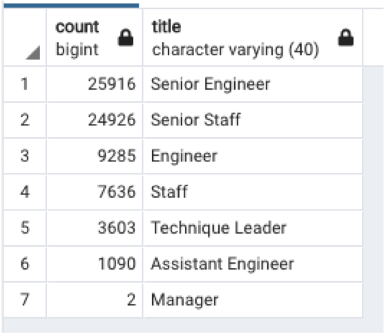

# Pewlett-Hackard-Analysis

## Overview 

The objective of the analysis is to determine the number of retiring employees per job title to help prepare a future hiring plan as well as implementing a mentorship program by identifying employees who are eligible to parcipate.

---
## Results

The breakdown of retiring employees per job title is shown in image below.

The summary of the data provides the following observations: 
* There is a higher demand for rides in suburban and rural cities than urban cities compared to the total drivers available.
* Urban cities have a ratio of about 2 drivers per ride, (more drivers than required rides).
* The average fares per ride and per driver is higher in rural and suburban cities compared to the urban cities, due to the higher ride demand compared to available drivers. 
* Total fare revenue is higher in urban cities compared to suburban and rural cities, due to the total amount of rides (61% higher than suburban and 92% higher than rural). See weekly total fare by city plot.

---
## Summary

The recomendations to the CEO would be to increase the amount of drivers in rural and suburban cities in order to supply the ride demand in those cities therefore reduce the average fare per ride and driver.  

---
